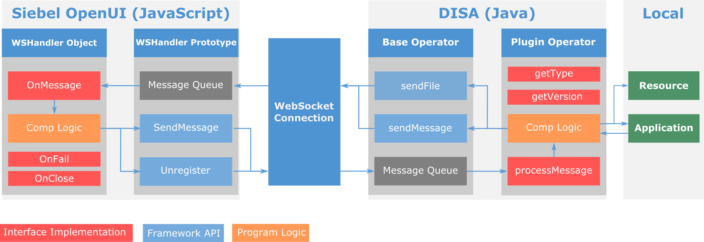
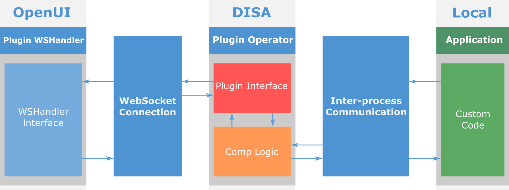

# DISA Development Guide

## **1\. Overview**

The Desktop Integration Siebel Agent (DISA) framework can be extended by customers to provide customized functionality (DISA 2.0.11 or higher). This will help customers fulfill any desktop integration requirements by using DISA's ability as a bridge between the Siebel Open UI application running in browser and local files, resources, and programs, potentially increasing their productivity and work efficiency.

This document describes how to develop custom plug-ins based on DISA APIs and integrate them with DISA framework.

Fig 1.1 shows the flow of communication for a DISA plugin. Thus we need to implement the following pieces of the puzzle to complete a plugin:

*   From Siebel OpenUI, create a WSHandler for the component
    *   Implement **callbacks** if necessary
    *   Implement **component specific logic**
*   Within DISA, create a component based on the Operator base class
    *   Implement **interfaces**
    *   Implement **component specific logic**
*   On both sides, call **framework interfaces** within the component logic to send messages between both sides




**Fig 1.1 Overview**

## **2\. Interfaces**

**WSHandler**

The following WSHandler and related codes could be added anywhere needed; however, generally we recommend implementing it in the pmodel of the corresponding component.

1.  Define the **Component Type** and **Component Version** constants of WSHandler.
    *   Specify a unique string with prefix "plugin_" as **Component Type**, to identify the WSHandler in Siebel OpenUI and its corresponding Operator in DISA plug-in.  
        The string at both sides should be exact the same so that they can communicate with each other.  
        This string will be used as the argument when calling SiebelApp.WebSocketManager.CreateWSHandler to create the customized WSHandler.
    *   Specify the **Component Version** to support component version check between WSHandler and Operator.
        Constant key: WS*\_COMPTYPE\_*VERSION. Replace *COMPTYPE* in middle with Component Type string defined above.  
        Constant value: in MAJOR.MINOR.PATCH format. Modify the version number according to rules defined in [Appendix A. Version Check (Backward Compatibility)](#appendix-a-version-check-backward-compatibility).  
        In order to pass the version check, the component version of WSHanlder at Siebel OpenUI should have the same or lower MAJOR version than the Operator version at DISA.
    *   Example - Constants Definitions

        ```js
        // The two specific constants should be defined in common SiebelApp.Constants in the following way
        // So that the Component Type and Version could be picked up by DISA Framework
        var consts = SiebelJS.Dependency("SiebelApp.Constants");
        consts.set("WS_COMPONENT_TYPE_SAMPLE","plugin_sample");
        consts.set("WS_PLUGIN_SAMPLE_VERSION", "1.0.0");
        ```

2.  Define the **WSHandler** (and its getter if necessary)
    *   Call **SiebelApp.WebSocketManager.CreateWSHandler** with Component Type defined in Step 1 as the argument.
    *   Set callbacks if necessary, including OnMessage, OnFail, and OnClose.  
        **OnMessage(msg, fileName, fileMsg)**: called when getting message from Operator at DISA. *fileMsg* argument only available when the incomming file includes a message.  
        **OnFail()**: called when failed to send message to DISA  
        **OnClose()**: called when connection to DISA is lost
    *   Example - WSHandler Definition

        ```js
        var sampleHandler = null;
        
        function getSampleHandler() {
            if (sampleHandler === null) {
                sampleHandler = SiebelApp.WebSocketManager.CreateWSHandler(consts.get("WS_COMPONENT_TYPE_SAMPLE"));

                sampleHandler.OnClose = onWSClose;
                sampleHandler.OnFail = onWSSendFail;
                sampleHandler.OnMessage = onWSMessage;
            }

            return sampleHandler;
        }

        function onWSMessage(msg, fileName, fileMsg) {
            if (msg instanceof Blob) {
                // Message is binary data
                // fileName is the ID of the binary data
                handleFile(msg, fileName, fileMsg);
            } else {
                // Message is in JSON format
                // fileName is undefined
                handleMsg(msg);
            }
        }

        // Normally this indicates something wrong with communication attempt to operator at DISA
        // Maybe because Siebel OpenUI never establishes connection with DISA due to various reasons
        // Maybe because the version number at two sides are not matched, operator version should be equal or newer
        // Reset state or other variables if necessary
        function onWSSendFail() {
            handleException("Failed to send message to DISA");
        }

        // This indicates Siebel OpenUI with DISA connection was lost
        // Maybe because Siebel OpenUI never establishes connection with DISA due to various reasons
        // Maybe because DISA exited (by user) or crashed
        // Reset state or other variables if necessary
        function onWSClose() {
            handleException("Connection to DISA was lost");
        }
        ```

3.  Implement **component logic** functions if necessary
    *   Example - Component Logic Functions

        ```js
        // Called by onWSMessage event handler
        function handleMsg(msg) {
            console.log("JSON message received: " + JSON.stringify(msg));
        }

        // Called by onWSMessage event handler
        function handleFile(msg, fileName, fileMsg) {
            console.log("File " + fileName + " received from DISA.");
            console.log("File attached message: " + JSON.stringify(fileMsg));
        }

        // Called by onWSClose or onWSSendFail event handler
        function handleException(err) {
            // Adds other error handling logic
            console.log(err);
        }
        ```

4.  Call **SendMessage(msg, fileName, fileMsg)** method of WSHandler to send message to the corresponding operator at DISA 
    *   *fileName* and *fileMsg* arguments are for binary message types, *fileMsg* requires a JSON object and it is optional
    *   Example - SendMessage of WSHandler

        ```js
        var handler = getSampleHandler();

        // This JSON message and structure should be expected by your DISA-side logic
        var msgJSON = {
            firstName: "First",
            lastName: "Last"
        };
        handler.SendMessage(msgJSON);

        // Another format supported is binary data (Blob is recommended, ArrayBuffer is also supported)
        // With binary data as the first arg, the fileName arg is required, fileMsg arg is optional, it must be a JSON object
        // fileMsg will be attached to the binary message.
        var fileContent = new Blob([JSON.stringify(msgJSON, null, 2)], {type : 'application/json'});
        var fileName = "test.json";
        var fileMsg = {
            date: "201608041747",
            id: "test_file"
        };
        handler.SendMessage(fileContent, fileName, fileMsg);
        ```

5.  Call **Unregister()** method of WSHandler to release the handler itself once no longer used, and it'll also send a command to DISA to unregister the corresponding operator.  
    For CSSWSSingletonOperator type, the operator would not actually be released though. For CSSWSOperator type, it would.
    *   Example - Unregister of WSHandler

        ```js
        /*
         * Typically executed in the applet pmodel EndLife, for example
         * EmailPModel.prototype.EndLife = function () {
         *     unregisterSampleHandler.call(this);
         * };
         */
        function unregisterSampleHandler() {
            if (sampleHandler) {
                sampleHandler.Unregister();
                sampleHandler = null;
            }
        }
        ```

**Custom Operator Plugin**

1.  Locate _&lt;DISA_HOME&gt;\DesktopIntSiebelAgent\lib_ folder and find **disa-api.jar** and **gson.jar** in this folder, add the two jar file paths to the class path of the plugin project.

2.  Create a plugin which will inherit from relevant "operator" base class
    *   Create **a new Java Package** for the component operator class and other related files if any. **It is strongly recommended that the plugin class should have a unique package name, to avoid potential conflict**.
    *   Create **a new component Operator class**.
        *   Inherit from **CSSWSSingletonOperator** if the operator is designed for sequential tasks, and does not have requirement for parallel execution. The requests for the same operator type from different components will be place in one queue and processed in a single thread.
        *   Inherit from **CSSWSOperator** if the operator is required to handling tasks in parallel, or tasks are expected to execute for a long time. Each component will be assigned to a new operator instance with a separate thread for each operator, tasks can be processed in parallel.
    *   Implement **getType**, return component type string. This string should be in accordance with the CompType specified when calling CreateWSHandler to create the corresponding WSHandler at Siebel OpenUI side. A custom plugin type must start with string "plugin_" to indicate it is a plugin operator.
    *   Implement **getVersion**, return component version string, to support comp version check between WSHandler and Operator. The version should be in MAJOR.MINOR.PATCH format. Modify the version number according to rules defined in [Appendix A. Version Check (Backward Compatibility)](#appendix-a-version-check-backward-compatibility)
    *   Implement **processMessage**, this is your primary task logic. If the operator message queue has new message added, this method will be called with the JSON format message as the parameter.
    *   Implement **component logic** needed as private methods.
    *   Implement **onSessionClose**  (optional), for any work need to be done when the connection to Open UI has been closed.
    *   Call **sendMessage** to send com.google.gson.JsonObject [gson](https://github.com/google/gson) type message from DISA to Siebel OpenUI.
    *   Call **sendFile** to send file from DISA to Siebel OpenUI, with fileName (full name including path), and optional fileMsg (JSON) as parameters.
    *   Example - Plug-in Operator

        ```java
        package com.domain.disa.plugin.sample;

        /*
         * The plugin class depends on disa-api.jar and gson.jar in the lib folder 
         */
        public class SampleOperator extends com.siebel.wsserver.operator.CSSWSSingletonOperator {
            // Operator public constants:
            // public static final Logger disaLog: DISA log object, logs by disaLog will go into DISA log file.
            // public static final String FILE_INFO: The key for file message.
            // public static final String FILE_NAME: In file message, this is the key for file name.
            // public static final String MESSAGE: in file message, this is the key for file message JSON.

            @Override
            public String getType() {
                return "plugin_sample";
            }

            @Override
            public String getVersion() {
                return "1.0.0";
            }

            /*
             * The main logic to process the message DISA gets from Siebel OpenUI
             * Any message DISA gets for this component type will be put in a 
             * queue, and this method will process messages in the queue.
             *
             * @param msg the current message in message queue
             */
            @Override
            protected void processMessage(com.google.gson.JsonObject msg) {
                // Sample code calling sendFile and sendMessage
                if (msg.has(FILE_INFO)) {
                    JsonObject fileInfo = msg.getAsJsonObject(FILE_INFO);
                    // if the current message is a file, the message should
                    // include a key named "FILE_INFO" and the value is the local
                    // path to this file.
                    String fileName = fileInfo.get(FILE_NAME).getAsString();
                    disaLog.info("Received file: " + fileName);
                    if (fileInfo.has(MESSAGE)) {
                        JsonObject fileMsg = fileInfo.get(MESSAGE).getAsJsonObject();
                        disaLog.info("File message: " + fileMsg.toString());
                    }
                    // Call sendFile(fileName) or sendFile(fileName, fileMsg) to send file to Siebel OpenUI
                    //sendFile(fileName);
                    sendFile(fileName, fileMsg);
                } else {
                    // The basic text message format is JSON
                    com.google.gson.JsonObject responseMsg = new com.google.gson.JsonObject();
                    responseMsg.addProperty("Echo", msg.toString());
                    // Call sendMessage(msg) to send JSON message to Siebel OpenUI
                    sendMessage(responseMsg);
                    disaLog.info("Echo Message back: " + responseMsg.toString());
                }
            }
        }
        ```

3.  Set META-INF for the newly created plugin
    *   Create a folder named "META-INF" in the plugin source folder (the root folder of package folders), if it does not exist.
    *   Create a folder named "services" inside the "META-INF" folder.
    *   Create a new text file named exactly "com.siebel.wsserver.operator.CSSWSOperator", without file extension.
    *   Add new class names including package name to the file, each class name takes one line.
    *   Example - META-INF for Plug-in

        ```java
        com.domain.disa.plugin.sample.SampleOperator
        ```

4.  Compile the class and pack the META-INF folder in a jar file.

**Communicate With DISA Plugin**

Another application may need to communicate with DISA plugin to exchange data or communicate with Open UI through a custom DISA plugin. This requirment can be achieved by implementing inter-process communication ([IPC](https://en.wikipedia.org/wiki/Inter-process_communication)).
*   Implement a custom WSHandler for the target applet or view. At the right time, send a message to DISA to activate plugin.
*   Implement a custom DISA plugin. Within its component logic implement the protocol to inter-process communicate with local application. The plugin need to be loaded by calling the plugin from Open UI before it can start the IPC logic.
*   In the calling application, implement inter-process communication with the DISA plugin.



**Fig 2.1 Inter-process Communication with DISA**

## **3\. Deployment**

At DISA side:

1.  Put plugin jars in _&lt;DISA_HOME&gt;\DesktopIntSiebelAgent\plugins_ folder.
2.  Restart DISA to reload all the plug-ins.

At Siebel OpenUI side:

1.  Deploy the js file including new WSHandler definition in Siebel OpenUI application.

## **Appendix A. Version Check (Backward Compatibility)**

DISA is supposed to be backward compatible with multiple versions of Siebel OpenUI application. From customization perspective, Component Version needs to be checked to support backward compatibility.

*   Component Version should be defined in MAJOR.MINOR.PATCH format.
    Modify the version according to following rules, increment the:
    *   MAJOR version when making incompatible API changes
    *   MINOR version when adding functionality in a backwards-compatible manner
    *   PATCH version when making backwards-compatible bug fixes
*   Component Version is defined at both sides: **Component at Siebel OpenUI** 
*   Component Version check happens on the first request of current component. It will report error (asking for upgrade) if the MAJOR version of **Operator** is lower.