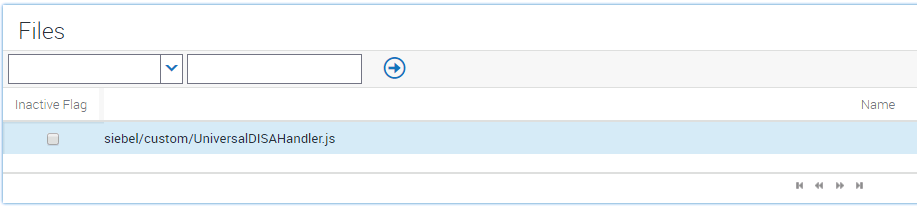
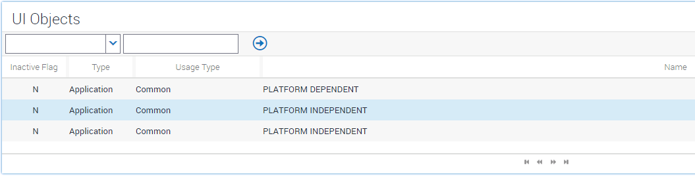
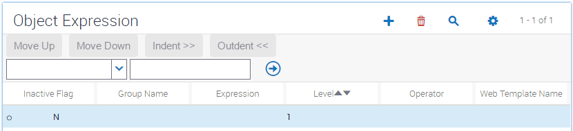
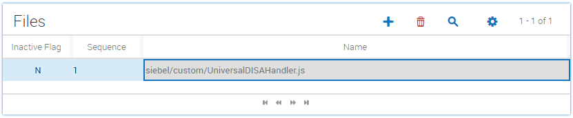

# Universal DISA Handler Example

This example creates a DISA handler which will be initialized once Siebel application loaded, and can be accessed across applets/views.

## OpenUI DISA Handler

1.  Put UniversalDISAHandler.js in Siebel JS custom folder
    *CLIENT_HOME*\PUBLIC\\*language_code*\\*release_number*\scripts\siebel\custom  

    where:  
    *   *ORACLE_HOME* is the folder where you installed the Siebel Server.

2.  Do manifest configurations for UniversalDISAHandler.js 
    1.	Log in to the Siebel OpenUI application with administrative privileges.

    2.	Navigate to Administration - Application screen, Manifest Files view.
    Add file entry for UniversalDISAHandler.js.  
    

    3.	Navigate to Administration - Application screen, Manifest Administration view.  
        Add file association.
        *   In the UI Objects list, add the following record.  
            Inactive Flag: *N*  
            Type: *Application*  
            Usage Type: *Common*  
            Name: *PLATFORM INDEPENDENT*  
            
        
        *   In the Object Expression list, add the following record.  
            Inactive Flag: *N*  
            Group Name: *(Leave Empty)*  
            Expression: *(Leave Empty)*  
            Level: *1*  
            Operator: *(Leave Empty)*  
            Web Template Name: *(Leave Empty)*  
            
        
        *   Specify the file for this record.  
            In the **_Files_** list, click **_Add_**.  
            In the **_Files_** dialog box, click **_Query_**.  
            In the **_Name_** field, enter: *siebel/custom/UniversalDISAHandler.js*.  
            Click **_Go_**, the record *siebel/custom/UniversalDISAHandler.js* should be listed in the Files dialog, click **_OK_** button.  
            

    4.	Log out Siebel and log in again, to make the changes take effect.

3.  Put code snippet in DISALOYMemberListPM.js into the click event handler of Phone button on the applet.

## DISA Plugin

*   Please follow the steps in [this document](https://github.com/OracleSiebel/ConfiguringSiebel/tree/master/ExampleCode/DISA/GetSystemInfo/java) to build UniversalPlugin.jar.

*   Put the generated JAR in *<DISA_HOME>*\DesktopIntSiebelAgent\plugins folder, and restart DISA to load it.

## Verify The Hanlder and Plugin

With all the above settings, re-login Siebel, there should be a log in browser console like:
> UniversalDISAHandler: JSON message received: {"Echo":"Hello, handler!"}.

To send messages to DISA plugin, call `SiebelApp.UniversalDISAHandler.SendMessage()` in JS code.

To handle messages from DISA plugin, add customized logic in function `handleMsg()` in *UniversalDISAHandler.js*.