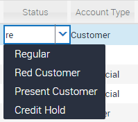
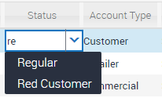
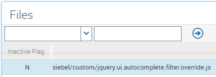
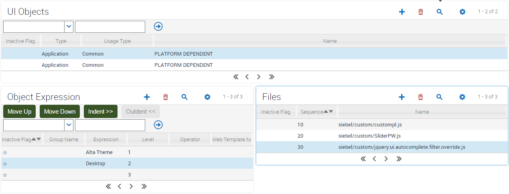

# Autocomplete Filter
When using picklists within Siebel, we get the default autocomplete functionality that is delivery with jQuery UI, which is to say that when you enter a letter or set of letters, the picklist is shown with all those picklist entries which CONTAIN that letter or letters.



Some customers have requested that autocomplete would be more effective for them if, instead of CONTAINS, it would be preferable if the picklist were restricted to those entries that START WITH the letter or letters entered.



### Implementation

To implement this requirement, we simply need to override the autocomplete filter algorithm that jQuery delivers as standard. Fortunately this is relatively simple and requires that we run the following code:

```
$.extend($.ui.autocomplete, {
    filter: function(array, term) {
        var matcher = new RegExp( "^" + $.ui.autocomplete.escapeRegex(term), "i" );
        return $.grep( array, function(value) {
            return matcher.test( value.label || value.value || value );
        });
    }
})
```

This needs to be something which happens at a global level, and after jQuery UI has initially loaded. Fortunately, we can guarantee this has all happened by the time the PLATFORM_DEPENDENT manifest entry is evaluated. So, in this case, we can simply enter the code above into a file, and ask for it to be loaded in that section of manifest administration.

##### Place custom JavaScript code

Copy the jquery.ui.autocomplete.filter.override.js file to your `public/<lang>/<build>/siebel/custom` folder (pre IP16) or `public/scripts/siebel/custom` folder (IP16+)

##### Register custom JavaScript file

Register the file within Manifest Files



##### Administer JavaScript file

Configure Manifest Admin so that this file is loaded when the application begins:


