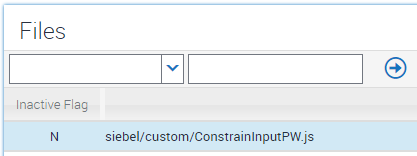

# Constrain Input Characters
In Siebel, all fields will allow any input characters from the keyboard to be entered, whether they're in edit mode, or query mode. This example shows how to constrain the characters that the user can use on their keyboard, and will focus on input fields that show a calculator helper.


The calculator helper appears here because the control has the "Runtime" property set, and the related field is a DTYPE_NUMBER. It's reasonable therefore to ask for the input field to only permit characters 1 to 9 and a decimal point to be allowed in the field. Siebel Open UI's extrensible framework allows us to implement this using a custom plugin wrapper (PW).


### Implementation

To implement the requirement, we need to write a plugin wrapper that will be used for all fields where the calculator helper is shown. In each case, we'll use the BindEvents method of the PW to catch keypresses, thus giving is the ability to approve or deny keypresses.

We can obtain a template PW from the [pw-code-generator](http://duncanford.github.io/pw-code-generator/?object=Calculator&name=ConstrainInput&comments=No&logging=No&I=N&SU=N&BD=N&BE=Y&GV=N&SV=N&BQ=N&EQ=N&OP=N&CP=N&HK=N&SS=N&EL=N&IQ=N) as a first step.

We'll allow the custom PW to apply to every input field in the application where a calculator helper appears by returning "true" in the AttachPW call:

```
SiebelApp.S_App.PluginBuilder.AttachPW(consts.get("SWE_CTRL_CALC"), SiebelAppFacade.SliderPW, function (control, objName) {
    return true;
});
```

We could be more specific here, applying the constraint to specific fields, controls, or using any logic we need.

All that remains is to capture the keypresses in these fields and process them, which we can do like this:

```
ConstrainInputPW.prototype.BindEvents = function () {
    SiebelAppFacade.ConstrainInputPW.superclass.BindEvents.apply(this, arguments);
    $(this.GetEl()).keypress(function (e) {
        var a = [];
        var k = e.which;

        for (i = 48; i < 58; i++)
            a.push(i);
        a.push(46); //period

        if (!(a.indexOf(k) >= 0))
            e.preventDefault();

    });
}

```

To apply this example functionality in your environment, take the following steps:

##### Place custom PW

Copy the ConstrainInputPW.js file to your `public/<lang>/<build>/siebel/custom` folder (pre IP16) or `public/scripts/siebel/custom` folder (IP16+)

##### Register PW

Register the PR within Manifest Files



##### Administer PW

Configure Manifest Admin so that this PW is loaded when the application begins:


### Issues

This solution only controls which keys can be used within this field. You could enter 1.2.3, for example, which will then be rejected by the standard error framework. However, you could implement a solution using Regular Expressions to apply more tight control over the data format entered.