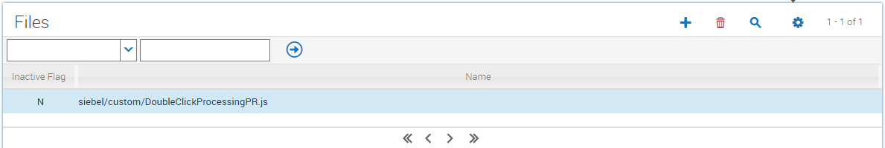
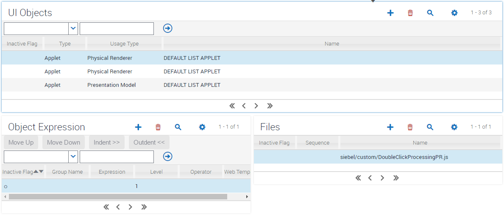

# Double Click

With the advent of Siebel Open UI, UI interaction went back to the drawing board and it was determined that, by and large, on the web there's almost no use of double-click interaction. However, double clicking provided a useful shortcut in Siebel HI that some users miss. Siebel's extensible framework makes it relatively simple to add this feature back in to your Siebel Open UI deployment should you so wish.

The example code given here applies to dynamic picklists, association applets, and MVGs. Three events are created.

- Double click on a picklist or association automatically picks that record and closes the applet
- Double click on an MVG list of available records automatically adds the record to the list of selected records and leaves the applet open so you can add more
- Double click on an MVG list of selected records automatically removes the record and leaves the applet open.

Because it's likely that you'll want this functionality to apply to the entire application, rather than applying it individually to many many pick applets and MVG, and because the overall effect of the change is quite small, we'll override the DEFAULT LIST APPLET PR to make this change system-wide.

## Implementation

### Register manifest file

### Administer manifest file

### Notes
As this overrides the default list applet renderer, making a mistake will render all list applets unusable. If you're not comfortable with this risk, override a single test list applet first instead of the DEFAULT LIST APPLET. Something like Contact List Applet for example. From IP16.8 forward, you can revert to seeded manifest records using a command line switch (https://blogs.oracle.com/siebelcrm/restricting-manifest-load-to-seeded-records) if you do get stuck.

The default list applet renderer is the one used when no applet specific manifest admin rules apply. Any customized PRs you have created for list applets will need to specifically extend this new default list applet renderer if you need them to inherit this double click functionality.

The most likely reason for issues with this and all PR is getting the case wrong in the file names.