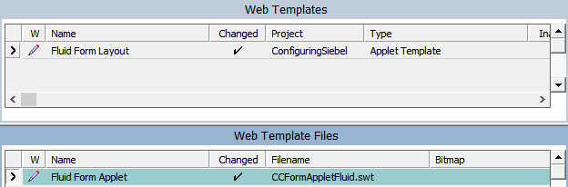
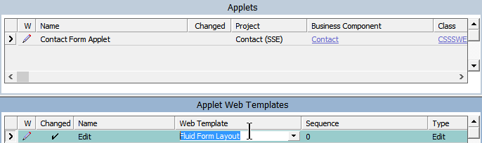
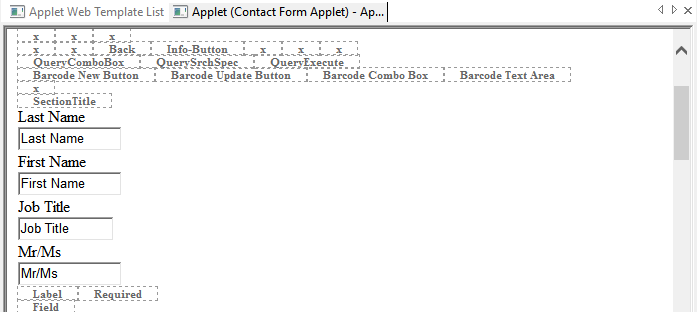
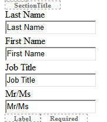
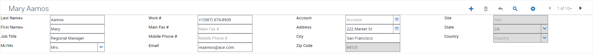
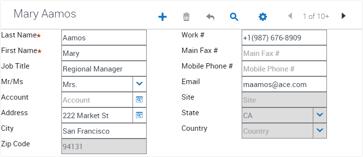
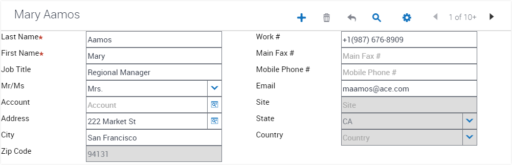

# Fluid Form Applet
Here I'm defining a fluid form applet as one which resizes well under two conditions:
- resizing of the browser (usually rotating a tablet, but could also be resizing for the desktop applet)
- removal of fields programmatically (via a custom PR)

#### Before

#### After

The primary reason for creating this example is to show how effective the switch can be to move from "Grid" based form applets to something more modern and fluid. Grid based layouts do offer a benefit which we lose if we go in this directions however (at least until IP17), which is WYSIWYG. Siebel Tools does not include CSS when interpretting an SWT file and thus we don't see the fluidity of our applet within tools, and we also don't get the responsive grid layout structure which is the result of the CSS. It's really just a question of getting used to compiling quickly and regularly in and then playing with a modern browser's responsive tools to assist the developer.

## Setup
In order to use these layouts, you'll need to copy the files into your OUIWEBTEMPL/CUSTOM folder. If you've already made the move to IP16, don't forget that there's no longer an OUIWEBTEMPL directory; everything is Open UI now, so in this case copy to WEBTEMPL/CUSTOM. You should do this for both the Web Client and Siebel Tools in order to be able to use Edit Web Layout from Tools.

With that done, go ahead and create a new Web Template record in Siebel Tools:



You're now ready to use the new template.

## Example
Let's work through an example of implementing our new fluid form layout. Our starting position will be the Contact Form Applet. Here's how it looks in IP16 by default:


This is a table based layout which gives a WYSIWYG layout from Tools. Let's switch that to the new fluid layout and see where we end up:



After compiling our workspace, we now have ...


Oh dear. It's empty. This is because the applet web template identifiers used in Grid layout are all over the place, so we need to re-map our fields into the new layout. This will require some thinking. There are no separate sections in this layout. If I want to spread the fields over four separate sections as they were initially, I will need to manually push my items into separate layout zones.

We'll start with the first column of fields from our original layout:



Each of these controls also has an existing width setting, which I'll remove as we want the layout to be dynamic now, not fixed.


Now it looks like this:



There's no hard and fast rule about how you layout your fields. It will normally be determined by use requirement. I'll push the next four fields in to the next section (below the next Section Title), and continue as closely as possible initially. Finally let's compile and see where we have:



So our content is now spread over the available space. Furthermore if we resize the desktop to a typical tablet size we see the responsive nature of the fluid applet:



As expected, the two columns at the right have been pushed into position.

It still seems that a default width of 175px is being pushed to the UI from somewhere. As I've added a custom theme override CSS to me environment, I can override this as my fluid form as a new class to mark each section which I can hook onto with:

```
.fluid-form-group input {
    width: 80% !important;
}
``` 



There's nothing to stop you registering multiple fluid form layout files to deal with different requirements.