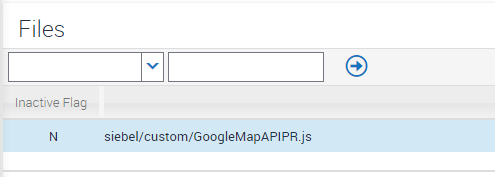

# Overview

This integration shows a basic integration between Siebel Data and the Google Map API to integrate a
fully usable Google Map into Siebel’s UI. This is the end result:

Here we see a single address in Barcelona and two addresses within California that have been clustered. The cluster can be clicked to re-scope the map to that area. The clustering implementation is implemented using an existing [Github project](https://github.com/googlemaps/js-marker-clusterer).

While this example shows an account's addresses being mapped, this is not a limitation. Anywhere data source which provides either a geo-codable address, or specific lat/long coordinates could be mapped. e.g.:

- Assets
- Quote Line Items (for complex network orders)
- Lat Long data captured when a mobile users makes an update, e.g. a photo attached to an SR
- Walk or Work routes

### How It Works

Looking at the screenshot once more, what we are essentially seeing is exactly the same data rendered
in two different ways. The top list applet uses the standard ‘ListPR’ to display the data in the jQuery Grid
control. The bottom applet is still a list applet, but uses a custom PR to take the records in the list applet
and send the address information to Google for geo-coding and plotting.

An IFRAME is used to keep the Google Map HTML and functionality separate from the Siebel OUI
Framework. This is important and is done in order to isolate the behavior of the two systems.

As a result of both applets being based on the same BC, records added to the list applet at the top are
automatically added to the list applet at the bottom, causing the map to move in accordance with the
new data. The same thing happens during deletes and queries and as we move through the list of
records. We get this behavior essentially for free from the OUI framework.

### Implementation

The assets folder contains four files. One is a SIF file containing an Applet and a Web Template. The next file contains the file for the Web Template. Then we have the custom physical renderer which takes addresses, geo-codes, and plots them. The final file is a copy of the marker clustering library, though you may wish to get the latest implementation of this from [that project's repository](https://github.com/googlemaps/js-marker-clusterer).

Let’s step through the configuration of your environment to leverage this new capability.

##### Import SIF

Import the SIF without fear. It contains a single Applet that almost certainly doesn’t exist in your environment already. It’s called ‘Account Address Google Map API Applet’. In addition, a new Web Template is added called ‘Applet List No Menu’. It’s possible this may exist in your system already, but unlikely.

##### Expose Applet on Existing View

Add the applet to an existing view; e.g. using the view ‘Account Detail - Business Address View’ will
duplicate the example image in the Outline section of this document.

##### Ensure Field Exists on BC

The custom PR assumes that the field containing the address will be called Full Address. If you use the imported applet above as is (i.e. without changing the BC), then you need take no further action. If however you wish to use the map elsewhere in the system, ensure that the BC from which the applet pulls address data has a field called Full Address. See the CUT Address BC for a typical definition for this field:

##### Compile Changes

That’s all of our changes in Tools complete. Next compile the following objects:

- Applet: Account Address Google Map API Applet
- Web Template: Applet List No Menu
- View: Account Detail - Business Address View

If you've made your changes within an IP16 Workspace, you can just compile all workspace changes in a single step.

##### Place New Web Template

Copy the asset CCAppletList_No_Menu.swt and place it in webtempl/ouiwebtempl/custom (pre-IP16) or webtempl/custom (IP16+).

##### Place Custom PR Code

Copy the asset GoogleMapAPIPR.js to public/enu/build/scripts/siebel/custom (pre-IP16) or public/scripts/siebel/custom (IP16+).

##### Place markerclusterer.js

Copy asset markerclusterer.js to public/enu/build/scripts/siebel/custom/3rdParty (pre-IP16) or public/scripts/siebel/custom/3rdParty.

##### Configure Manifest

First we need to add a new record in Manifest Files to register our custom PR.

With this done, we can create the manifest administration record so that our custom PR is used for the new applet:

We don't need to specifically call out when markerclusterer is loaded. This is a automated for us by the code in the PR.

##### Test

Finally clear the cache and restart the application. You should now be able to navigate to the view you
altered and see the addresses being mapped.

### Limitations

At present, all markers are identical. It would be a simple matter to extend the solution so that the BC
also contained a calculated field to determine the icon to use on the map. This can then be passed to
the map whilst adding the markers.

As this utilized Google’s online facilities, Google must be ‘visible’ to any client machines using this
extensions.

At present, the integration uses anonymous access to the Google API v3 library. This limits usage to the
request IP to 15,000 per day. If this were to be widely deployed in an organization, it’s likely that the
organization would need to sign up with Google for an enterprise account, which will then grant more usage.
Code has been added to allow you to quickly switch to a Google API Key, which can be [obtained freely](
https://developers.google.com/maps/documentation/javascript/get-api-key)

If you have any issues using this example, please record an issue in Github.