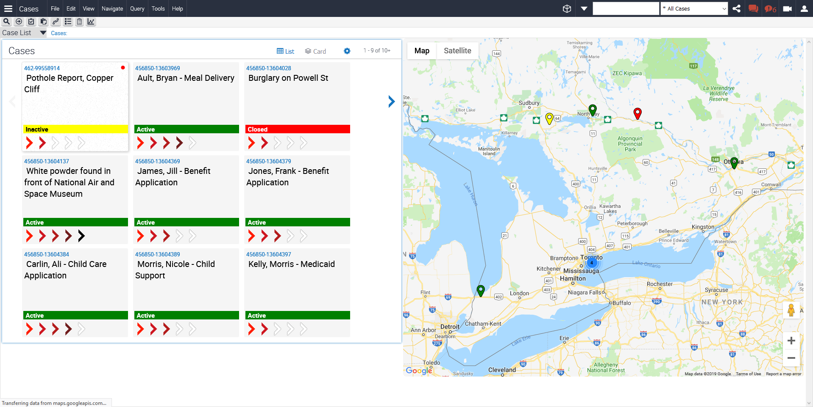
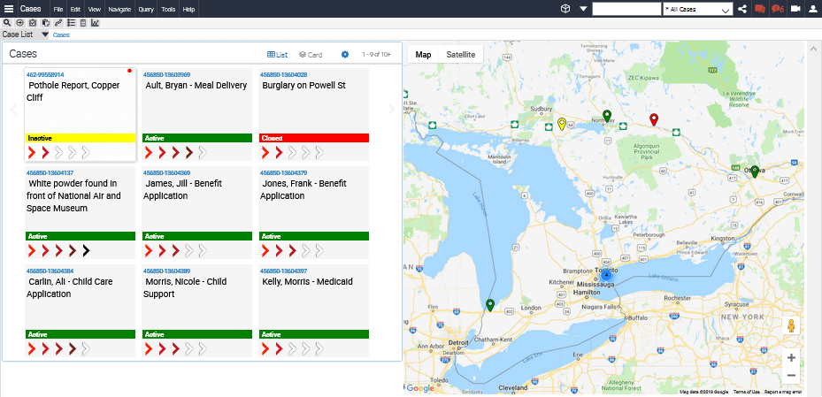
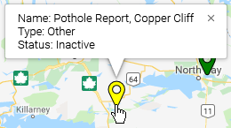

# Overview

This integration demonstrates integration between Siebel Data and the Google Map API to integrate a fully usable Google Map into Siebel’s UI. This is the end result:

Here we see a list of cases on the left and on the right, the primary addresses associated with these cases. Where multiple addresses are close together at the current level of zoom, a cluster icon replaces the individual markers . The cluster can be clicked to re-scope the map to that area. The clustering implementation is implemented using a [Google Maps Plugin](https://developers.google.com/maps/documentation/javascript/marker-clustering).

Note: this is reworked for IP17+ from the [previous version](../v1).

### How It Works

Looking at the screenshot once more, what we are essentially seeing are exactly the same records rendered in two different ways. The left list applet is using a customised Tile layout to display key record data. The right applet is still a list applet, but uses a custom PR to take the records in the list applet and send the address information to Google for geo-coding and plotting.

An IFRAME is used to keep the Google Map HTML and functionality separate from the Siebel OUI Framework. This is important and is done in order to isolate the behavior of the two systems. As the IFRAME sandboxes the Google functionality, we implement [postMessage](https://developer.mozilla.org/en-US/docs/Web/API/Window/postMessage) to communicate between the code controlling the map and the code in the custom PR. This allows us to keep the map and the list of records in sync, so that, for example a different record can be selected either by using the map or the tiles, and the tiles will hide or show when the map is moved or zoomed.

Finally, a Google Maps [InfoWindow](https://developers.google.com/maps/documentation/javascript/examples/infowindow-simple) is implemented to display additional record data when the user moves the mouse over a map marker.

### Implementation

The assets folder contains a number of files:

* the [custom physical renderer](assets/GoogleMapAPIPR.js) which takes addresses, geo-codes, and plots them.
* [content for a custom web template](assets/AppletNoMenu.od) you can import to a new web template record and associate to the list applet you copy as a basis for the address data.
* a copy of the [marker clustering library](assets/markerclusterer.js) is provided, though you may wish to get the latest implementation of this from the above link.
* a set of images for clustered markers

Let’s step through the configuration of your environment to leverage this capability.

##### Configuration

Create a new workspace to contain your customization. Next create the custom web template record, using the [content supplied](assets/AppletNoMenu.od). You can call this whatever you like; I called it 'Applet List No Menu'. Find a list applet connected to address data, and copy it, associating the web template you just created, and then alter the fields in the applet to provide the you wish to display on the InfoWindow and to access an address for later geocoding.

##### Expose Applet on existing View

Add the applet to an existing view.

##### Ensure Field exists on BC

The custom PR assumes that the field containing the address will be called Full Address. If you use the imported applet above as is (i.e. without changing the BC), then you need take no further action. If however you wish to use the map elsewhere in the system, ensure that the BC from which the applet pulls address data has a field called Full Address, or alter the code for the field that does contain the address. See the CUT Address BC for a typical definition for this field:

##### Place custom PR code

Copy the asset GoogleMapAPIPR.js to public/scripts/siebel/custom.

##### Place markerclusterer.js

Copy asset markerclusterer.js to public/scripts/siebel/custom/3rdParty.

##### Place images

Copy the m1  - m5.png files in public/images/custom.

##### Configure Manifest

First we need to add a new record in Manifest Files to register our custom PR.

With this done, we can create the manifest administration record so that our custom PR is used for the new applet (don't copy this image blindly; adjust the name of the applet to the applet you create above):

We don't need to specifically call out when markerclusterer is loaded. This is automated for us by the code in the PR.

##### Test

Finally clear the cache and relogin to the application. Open the Workspace dashboard and inspect the workspace containing your config. You should now be able to navigate to the view you altered and see the addresses being mapped.

### Limitations

As this utilized Google’s online facilities, Google must be ‘visible’ to any client machines using this service.

### Notes

Note that the integration uses the Google API service which provides a relatively small number of geocode calls for free. If this were to be widely deployed in an organization, it’s likely that the charges would be incurred. You will need a Google API Key, which can be [obtained freely](
https://developers.google.com/maps/documentation/javascript/get-api-key)

### Issues

If you have any issues using this example, please record an issue in Github.