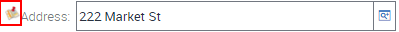
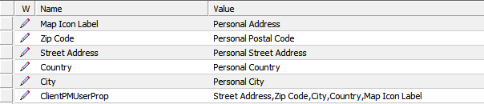

# Oracle Maps Integration

## Overview

This integration will adds access to an Oracle Maps modal window from the customer form applet using the [colorbox](http://www.jacklmoore.com/colorbox/) plug in. Once implemented, the address label will have an additional icon as highlighted below:

Clicking this icon will reveal the contact location in a map

## Testing

Tested with
- IP15
- IP16

## Instructions:

- Place OracleMapsPR.js and OracleMapsPM.js under custom script folder
- Download colorbox and unzip under siebel/custom/3rdParty. Add a reference to the colorbox css style under Manifest Files, and add the css to your theme.
- Set PM user properties for Street Address/ZIP Code/City/Country for appropriate controls (see [here](https://docs.oracle.com/cd/E14004_01/books/config_open_ui/customizing10.html) more info)

- Register the files in the manifest to the desired applet

 
## General Remarks:

- Address location geocoding and map rendering are asynchronous.
- Icon is added before the label for the control identified by the Map Icon Label user property.
- Latitude/Longitude is calculated from Street Address, City, Postal Code, Country
- If the address can't be found the colorbox pop-up will display: "Address not found!"
 
## Contact:

Feel free to contact me via [GitHub](https://github.com/carlosmlribeiro) or [LinkedIn](http://www.linkedin.com/in/carlosmlribeiro) if you have any questions or suggestions.
