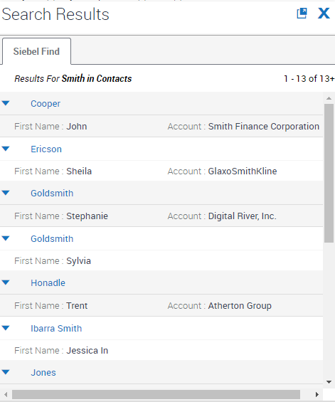
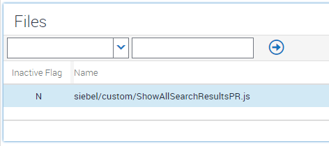
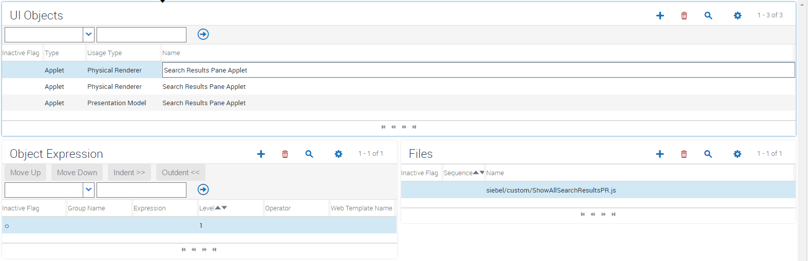

# Open All Search Results

This code modifies Siebel (IP16+) slightly so that, following a search, all search results in the search pane are automatically opened.

This is essentially just a small piece of code which automates the clicking of each detail-arrow in the search pane. Unfortunately, due to some other event handling in the framework, there is seemingly no way to lock this down precisely, so I've opted to use a one-second pause before automating the openeing of the search results. You can tune this for your environment.

### How To Apply

As with all applet customizations, to apply this change we need to register the custom PR in Manifest Files and then configure Manifest Administration to connect the custom file to the appropriate applet.

##### Copy custom PR

Place the ShowAllSearchResultsPR.js file in sweapp\PUBLIC\scripts\siebel\custom.

##### Manifest Files

##### Manifest Admin

