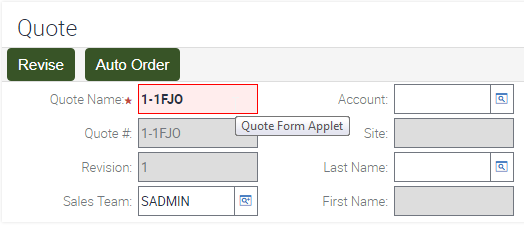

# Remove Applet Names from Hover

By default, the Siebel application is designed to be an accessible application. To achieve this, a number of landmarks exist within the system to assist navigation, but sometimes these can get in the way.



Here you can see the name of the applet Quote Form Applet appearing when the user moves the mouse over this applet. While this has some utility for a developer, it's not so useful for most users. In addition, navigation items can have similar unwanted hover results:


If desired, these can be trimmed through post processing by removing the title element from various UI elements. You can adjust this snippet to meet your requirements.

```
$("[title]").not("[role=grid] td, #s_toolbar, #s_toolbar li").removeAttr("title");
```

This works by first selecting all elements that have a title attribute and then trimming that list to leave certain elements alone. Finally the title attribute is removed from all remaining elements.