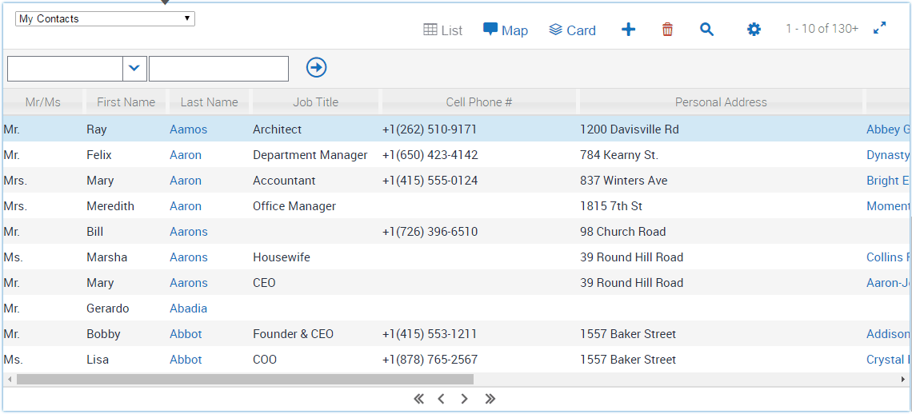
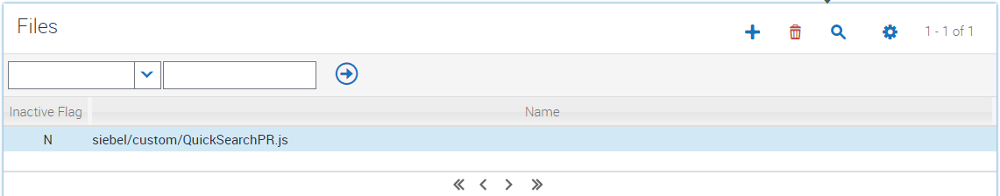
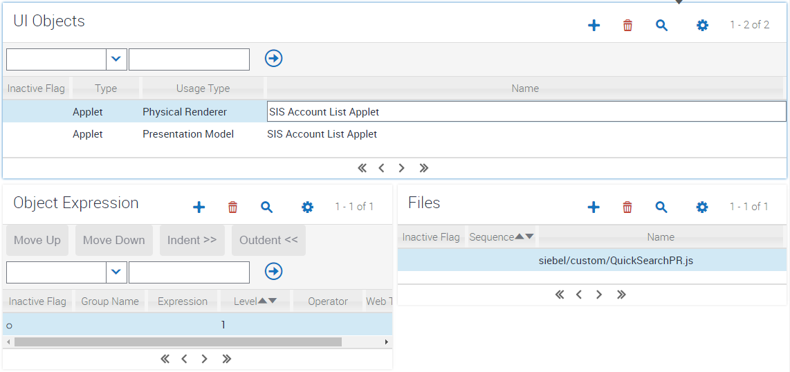
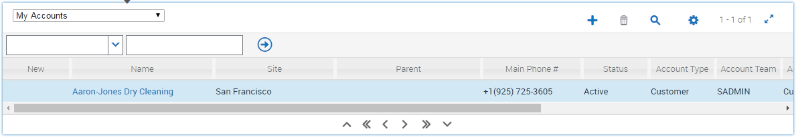

#Quick Search

Quick search is a way to improve searching through results in a list applet. Sometimes there's just no way to avoid the need to look through 200 or so records, at which point moving a page at a time or a record at a time seems painfully slow.

So, Quick Search to the rescue.

Delivered here as a custom PR, you can choose whether to apply this to a specific list applet, or implement it as a new default list renderer. If you do choose to change the default though, don't forget to look at your existing custom PRs for list applets and re-parent them to this one if required.

Let's see it in action.

This is the default best speed of pagination by repeatedly clicking the next page button.

By ten seconds, I managed to click through 400 records, so about 40 clicks; wonderful repeated strain. Now here's what happens if I just click and hold:

In the same time, this has taken me through 710 records, a marked speed increase. And of course, just one press and hold; that's the main thing.

To implement this then, copy the QuickSearchPR.js file to your scripts/siebel/custom folder and register it through manifest files:

Then administer it for a list applet of your choice:

Finally a word of warning. I tested this with Chrome, Firefox, IE11, and Microsoft Edge. It seems to work well in all but Firefox; perhaps you can help fix it?

Update: It seems that system with high latency are not working well with this modification. This is due to the fact that, for some reason, if the mouse moves while holding it down, it registers as a mouseleave even if the mouse is not moved away from the icon. This in turn triggers the code to stop the repeated navigation. Thus two alternatives are also now provided.

#Keyboard Accelerators

By default, Siebel is supplied with the following keyboard accelerators. These keys can be held down in order to repeat the associated functionality, thus providing access to repeated next page capability without needing the config above.

Here's how those accelerators as seeded by us:

- First Record Set
 - Command - First Page (SWE)
 - Accelerator - ALT+F
- Previous Record Set
 - Command - Previous Page (SWE)
 - Accelerator - CTRL+ALT+,
- Previous Record
 - Command - Previous Record (SWE)
 - Accelerator - CTRL+UP
- Next Record
 - Command - Next Record (SWE)
 - Accelerator - CTRL+DOWN
- Next Record Set
 - Command - Next Page (SWE)
 - Accelerator - CTRL+ALT+Y
- Last Record Set
 - Command - Last Page (SWE)
 - Accelerator - ALT+L
 
 
 These accelerators can be altered through Siebel configuration. For example, CTRL+Left and CTRL+Right could be associated with the First Page and Last Page commands.
  
 #First and Last Record Navigation Buttons
 
 Continuing with the theme above of being made aware of keyboard accelerators for first and last page navigation, we can also add buttons to the list applet UI to expose these to users:
 
 
 
 To create these additional buttons follow the same steps above for Manifest File registration and administration, except use the FirstLastButtonsPR.js file instead. To achieve the icons shown in the image above, the assumption is made that you've already applied the styling from the [larger navigation items theme customizatioN](https://github.com/OracleSiebel/ConfiguringSiebel/tree/master/ExampleCode/Open%20UI/Theme%20Customizations/Snippets/Larger%20Table%20Navigation%20Icons). Just add the addional two lines given in the firstlastbuttons-snippet.css file to add style to the new first and last record buttons