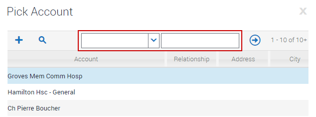
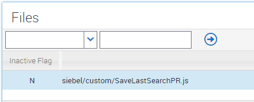
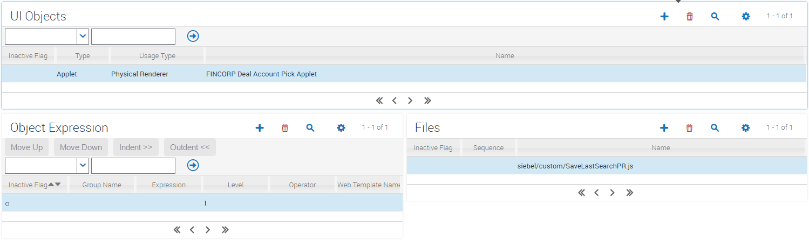

# Save Last Applet Search
By default, for standard list applets, the left hand box which is the field selection begins empty. For a Pick Applet, or the Associate Applet for an MVG, the field selection is pre-populated with the first item in the list. This PR results in the last applet search field being saved. On return to the customized applet, the previously searched field will be automatically re-populated. This could be applied to specific applets or applied system wide. We will cover here applying it for a specific applet.

Specifically we are referring to the current representation of the search assistant:

The code used saves the last search for the specific applet within the user's user preference (SPF) file, so they should find this saved search will be remembered even if they use a different machine. Ideal for hotdesking!

### Implementation

Three steps are required to implement this:

##### Place custom PR

Copy the SaveLastSearchPR.js file to your `public/<lang>/<build>/siebel/custom` folder (pre IP16) or `public/scripts/siebel/custom` folder (IP16+)

##### Register PR

Register the PR within Manifest Files

##### Administer PR

Configure Manifest Admin so that this custom PR is used for an applet

### Issues

Feel free to register any issues you may encounter, preferably with a pull request to solve the issue.