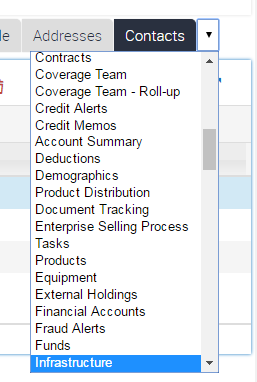
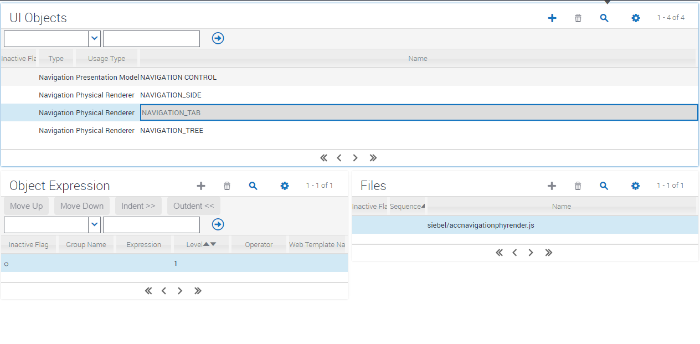
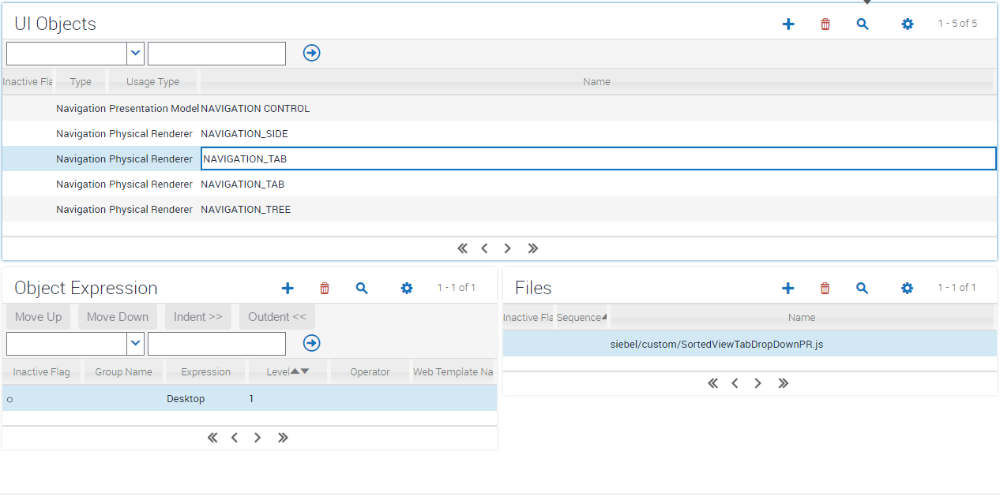

#Sorted View Dropdowns for Tab Navigation

For a fresh Siebel application, the high likelihood is that you'd like a some combo-box contents to be sorted. Customers want to maintain the ability to customize the order in line with working practice, so this may not be for you. Here's an example of the problem in a freshly installed system:



While this is ordered according to config, it's hard to find what you're looking for. By overriding the navigation renderer we can order this content. In order override a navigation renderer, we following a very similar pattern to that used for overriding an applet renderer. First we observe the existing renderer, extend it, and add our own functionality at the right stage of the render process. This code overrides the order of dropdown when the "Tab" navigation mode is selected. In this case, the existing renderer is driven from accnavigationphyrender.js:



We start by overriding this with a custom record with a similar definition:



You can simply take the file SortedViewTabDropDownPR.js and drop it into your siebel/custom folder. Let's take a look at the two key sections of the code:

```
SiebelJS.Extend(SortedViewTabDropDownPR, SiebelAppFacade.AccNavigationPhyRenderer);
```

This line sets up the inheritance of all behaviour from the default navigation renderer. With this done, we can define our custom functionality. In this case, we're only interested in overriding the BindData step, which let's us tap into the event model right after the original renderer completes the processing of navigation data:

```
SortedViewTabDropDownPR.prototype.BindData = function ( bRefresh ) {
				SiebelAppFacade.SortedViewTabDropDownPR.superclass.BindData.call ( this, bRefresh );
				$('#j_s_vctrl_div_tabScreen option').sort(NASort).appendTo('#j_s_vctrl_div_tabScreen');
				$('#j_s_sctrl_tabScreen option').sort(NASort).appendTo('#j_s_sctrl_tabScreen');				
				$('#j_s_sctrl_tabView option').sort(NASort).appendTo('#j_s_sctrl_tabView');				
			};
```

This code uses hardcoded references to known UI elements containing the tab dropdowns for the screen tabs, the 2nd level navigation tabs, and the view tabs. It sorts the content and replaces the original content with the sorted content. This delivers the end result we need:


