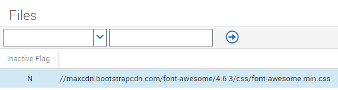
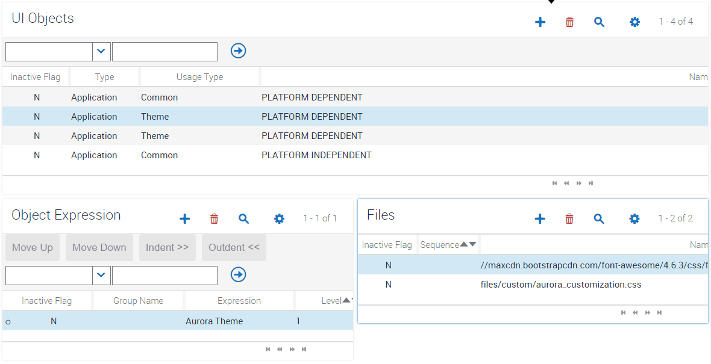

#Add an Icon Pack
As delivered, Siebel comes with an Oracle font file which provides the range of glyphs used in the application. If you want to add another icon pack, this is really simple. Some of the snippets require you to have taken this step before they will work correctly. If the snippet calls for a different icon set, simply follow the process used here to demonstrate adding [Font Awesome](http://fontawesome.io/) to either add that icon set from a locally stored font, or reference it directly from a web-based CDN.

In the case of FontAwesome, it's easy to [find a CDN](https://www.google.com/search?q=font+awesome+cdn&oq=font+awesome+cdn) which can serve up the required files without needing to copy them locally. The top hit on Google gives us this link:

https://maxcdn.bootstrapcdn.com/font-awesome/4.6.3/css/font-awesome.min.css

We can register this directly under manifest files like so:

Finally add it to your theme's loading sequence:

You can now reference this new icon pack using CSS.