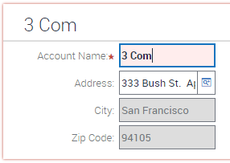
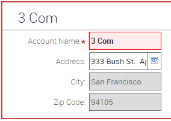

#Commit Pending Indicator
IP16 introduced a commit-pending indication to inform users that there is unsaved data on screen. By default this is quite subtle:

This snippet gives an example of a custom style snippet to control this feature:

