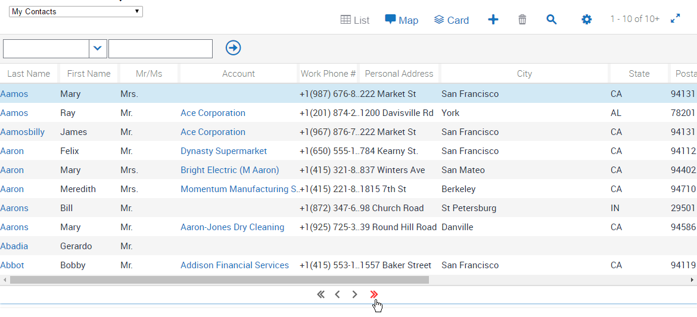

# Larger Table Navigation Icons
By default, the table navigation icons are quite small.

It's easy to choose whichever icons you like. We'll pick some from [Font Awesome](http://fontawesome.io/) to show how to change them. If we're going to use Font Awesome, we'll need to have already [added that icon pack](./Add an Icon Pack) to the system.

Looking through Font Awesome's icons, I selected the following:
- [fa-angle-double-left](http://fontawesome.io/icon/angle-double-left/)
- [fa-angle-left](http://fontawesome.io/icon/angle-left/)
- [fa-angle-right](http://fontawesome.io/icon/angle-right/)
- [fa-angle-double-right](http://fontawesome.io/icon/angle-double-right/)

In addition, we can highlight them clearly when the user hovers over them in order to improve user feedback:

