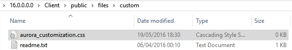
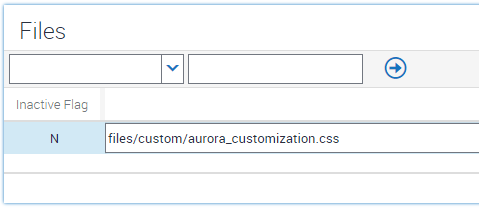
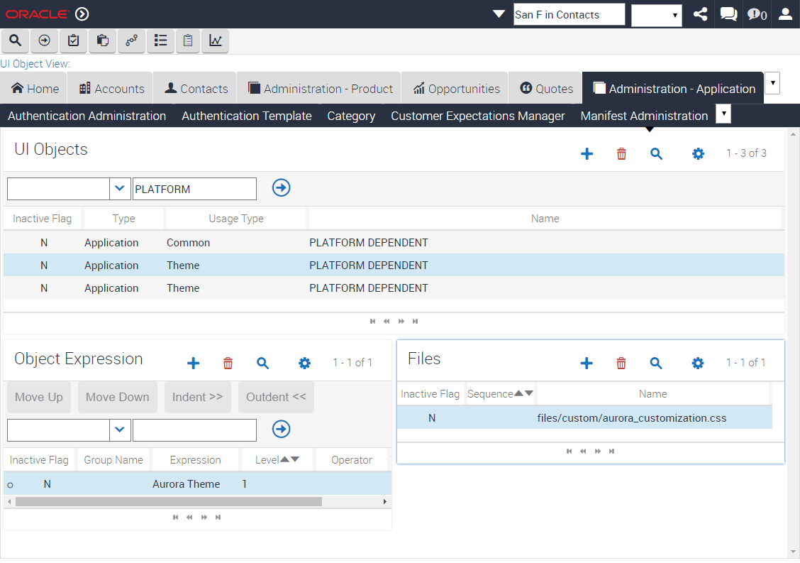

# Customizing the Siebel Theme
## Overview
By default, Siebel ships with a number of themes. In the vast majority of cases, there's no need for you to create a completely new theme from scratch. Much of the time, you can achieve your aims by simply adding an additional CSS file into the mix with one of the existing themes. This can serve two functions:
- Override existing styling
- Provide completely new styling for your customizations

In this directory, you'll find short snippets of CSS which you can insert into this addditional CSS file. For the purpose of this document, I will use IP16 to cover the details. You will need to consider and adapt appropriately if you are configuring earlier versions.

## Best Practice
This pattern for modifying the style is the best practice for 99% of style modifications. The alternative, modifying a delivered theme file, is not recommended for several reasons. The benefits of overriding instead of copying are clear:
- Small file containing modifications eases maintenance
- Any new styles in the delivered file with new patchsets are available
 - A copied file with changes embedded in it requires lengthy maintenance to keep in line with new delivered styles
- No unexpected results from copying an existing theme file into the custom folder
 - This occurs because often CSS uses relative references which are all broken if the file is moved to a different folder


## Preparation
In order to use any of the snipppets, you'll first need to have a custom CSS file added to the existing theme. Start by creating an empty file in \public\files\custom. There are no guidelines for what to call this file. For now, we'll call this aurora_customization.css.



Now we need to ask Siebel to load this file at the same time that it loads the existing theme files. To do this, we must first register the new file using Manifest Files, and then configure Manifest Administration to load this file for a given theme.

#### Manifest Files


### Manifest Admin


With these changes in place, an ensuring that our test user has the Aurora theme selected, we should see the custom theme files being delivered to the UI. Right click anywhere on the UI, select Inspect (I'm using Chrome), and examine the content of the ```<head>``` section. You should see the following:

```
<link id="PLATFORM_DEPENDENT_Application0" type="text/css" rel="stylesheet" href="files/theme-aurora.css?_scb=16.1.0.0_SIA_[23057]_ENU">
<link id="PLATFORM_DEPENDENT_Application1" type="text/css" rel="stylesheet" href="files/custom/aurora_customization.css?_scb=16.1.0.0_SIA_[23057]_ENU">
```

A this stage, any content we place in the custom CSS file will be both added to the total CSS being used, and in addition if the same CSS selectors are user, anything we place here will override existing CSS defined in any delivered CSS files.

## Add a Snippet
You're now ready to just copy CSS-only snippets into your new customization CSS file. To test this, take the logo snippet for a [white Oracle logo](Snippets/Logo/oracle-white-logo.css) as an example. Copy the code from the snippet straight into your customization CSS file, then simply reload your UI. If everything has been done correctly, you should see the new result straight away.


