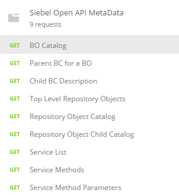

# Postman Collections

[Postman](https://www.getpostman.com/) is a great tool for testing APIs. Provided here are two collections for testing the [Siebel REST APIs](https://docs.oracle.com/cd/E88140_01/books/RestAPI/RestAPI_Overview2.html#wp1016697).

Siebel REST APIs give access to three types of interaction:

* Data
* Repository
* Service

For each type of interaction, there are two things you might want to do; you might want to perform the interaction, and you might want to describe the interaction. The ability to perform these interactions via REST was released in IP16 and the ability to describe the interactions was released in IP17.

In the Describe folder above, the collection allows you to use the catalog APIs in order to describe Siebel objects. Once you import the collection's JSON file into Postman, you will see the following:

Note that each of the examples in this collection only work with IP17. You will need to update the URL to match the location and port for your Application Interface. Hopefully you'll also need to adjust the username and password too.

The Perform folder will be populated soon.